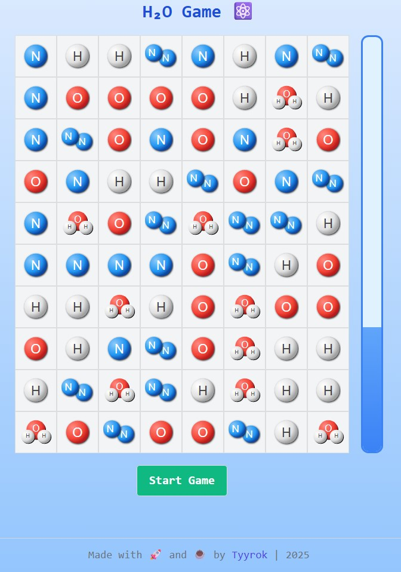

## H2O board browser game based on GO + Websocket + Alpine.js

[Try it here](https://h2o.tyyrok.online) — a simple browser game where the main goal is to gather water molecules to fill the flask!

I was inspired to make this tiny game during reading amazing Lectures on Physics from Richard Feynman.

### Repository Includes:
- Go backend service
- docker-compose.yml for local deployment
- Startup shell script
- Environment variable template (.env.template)

### Setup Instructions and Usage Instructions
1. Database Setup. Use PostgreSQL — either a local instance or Supabase as a hosted option.
2. Copy .env.template to .env and fill in the required values.
3. Start service by `./start.sh` or `docker-compose up --build -d`

### Screenshots

